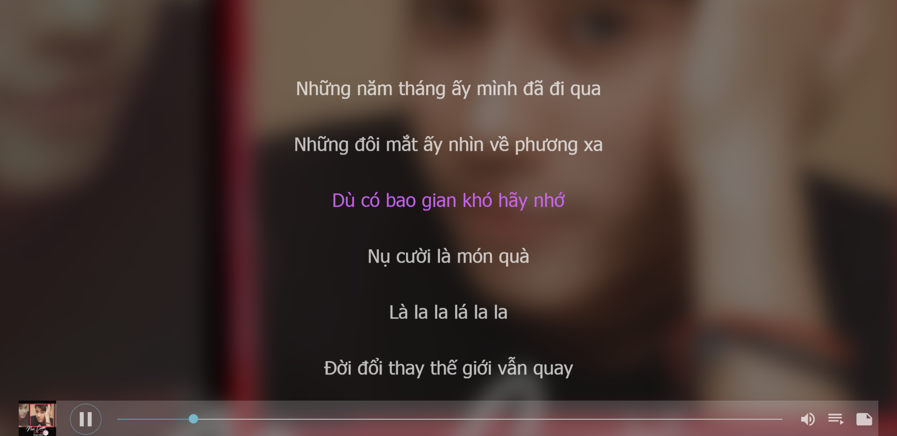
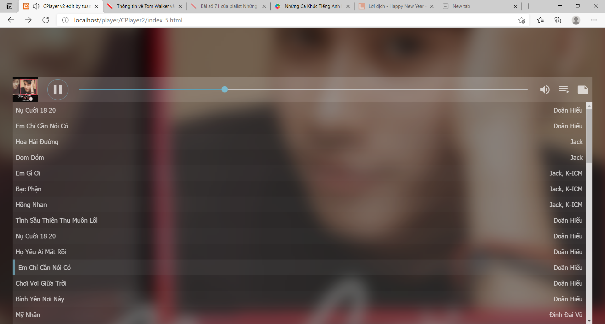
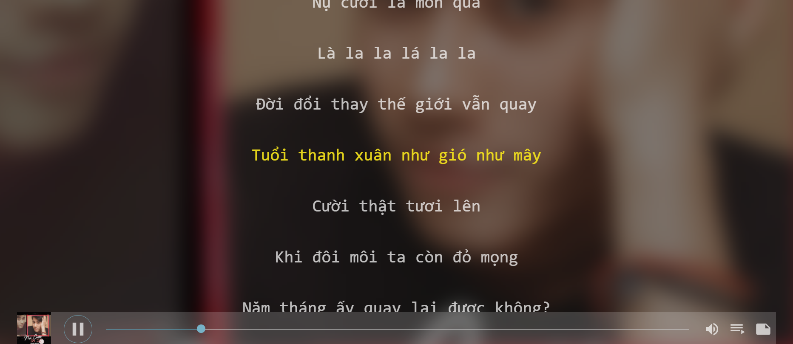
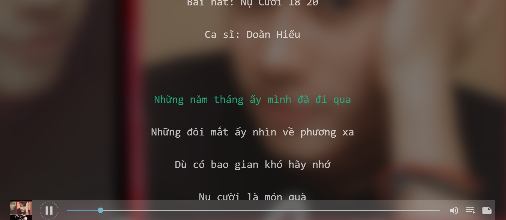
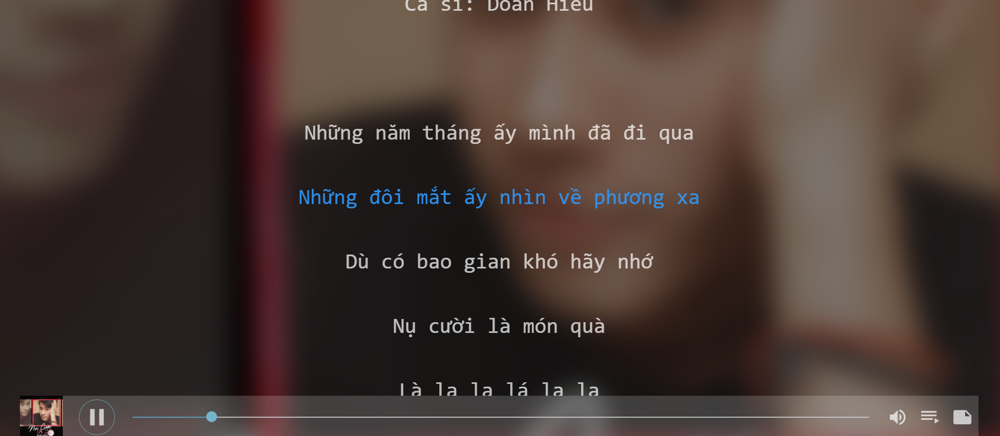
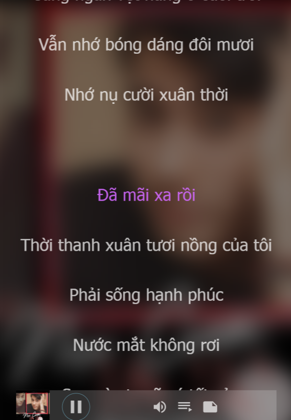

# cPlayer 

__Warning: Loaded well in Internet Explorer 10+, FireFox, Chrome, Edge and so on...(Modern Browser like.)__

---

## Screenshot








---

## Install && Build

```bash
npm install
npm run dist
```

### Make a DEMO and serve with it

```bash
npm run demo
npm run serve
```

## Usage

### HTML

```html
<html>
    <body>
        ...
        <div id="here"></div>
        ...
        <script src=".../cplayer.min.js"></script>
    </body>
</html>
```

### Javascript

```javascript
let cp = new cPlayer({
    "element":document.getElementById("here"),
    "list":[
        //Sync
        {
            "name":"xxx", //The Music's Name
            "artist":"www",//The Music's Artist
            "image":"http://xxxxx",//The Music's Cover
            "url":"http://xxxxx",//The Music's URL
            "loop":true,//If loop === true,the Music will be played again and again.
            "lyric":`
            [00:00.00]XXXXXXXX
            .....
            [00:99.99][11:99.99]XXXXX
            `,//The Lyric(Extra)
            "transLyric":`
            [00:00.00]XXXXXXXX
            .....
            [00:99.99][11:99.99]XXXXX
            `//The Translated of Lyric(Extra),Must work with `lyric`.
        },
        //Async
        {
            "name":"xxx",
            "artist":"www",
            "img":"http://xxxxx",
            "url":{
                "waiter":fetch("xxx").then(xxx),
                "resolve":function(xxx){...} //param is what you have got from waiter(),which means that the xxx includes not a Promise but sth else.And it should return a string.
            },
            "loop":true,
            "lyric":{
                "waiter":fetch("xxx").then(xxx),
                "resolve":function(xxx){...} //Nearly as same as above,but it should return {lyric:string|null,transLyric:string|null}
            }
        },
        .........
    ]
});
```

## APIs

* `cp.play()` // Play
* `cp.pause()` // Pause
* `cp.volume(number)` // Set Volume
* `cp.isMuted()` // Return if the music is muted
* `cp.isPaused()` // Return if the music is paused
* `cp.last()` // Set the previous music
* `cp.next()` // Set the next music
* `cp.to(now)` // Set the music you set
* `cp.hasLyric(id)` // Return if the music you set has lyric
* `cp.showLyric()` // Show the Lyric Body,if the music at that time hasn't lyric,DO NOTHING;if the Lyric Body is already shown,HIDE IT.
* `cp.hideLyric()` // Hide the Lyric Body
* `cp.hasList()`
* `cp.showList()`
* `cp.hideList()` // (The Same As Above)
* `cp.add(options)` // Add music(the options is like above)
* `cp.lyric(a)` //`<async>` Set Lyric or Get Lyric
* `cp.refreshLyric()` //`<async>` Refresh the lyric now from `__LYRIC__`(unuseful)
* `cp.updateTime()` // Set Music's Current Time
* `cp.on(eventName,func)` //Set Events
* `cp.translate()` //`<async>` Make the translated(with transLyric)

## Events

Now Here are some events.

| Event          | param | Note                                                         |
|----------------|:-----:|--------------------------------------------------------------|
|play            |       |                                                              |
|pause           |       |                                                              |
|volumechange    |   √   | Return the music's own event object                          |
|timeupdate      |   √   | The same as above                                            |
|canplaythrough  |       |                                                              |
|ended           |       |                                                              |
|toggle          |       |                                                              |
|previous        |       |                                                              |
|next            |       |                                                              |
|changeList      |       |                                                              |
|changeLyric     |       |                                                              |
|slideList       |   √   | If showed,the param is `true`;If not,the param is `false`    |
|slideLyric      |   √   | The same as above                                            |
|clickListPower  |       |                                                              |
|clickLyricPower |       |                                                              |
|clickVolumePower|       |                                                              |

### Usage

```javascript
cp.on("slideLyric",([showed])=>{
    if(showed===true){
        //...
    }else{
        //...
    }
}).on("timeupdate",([ev])=>{
    //...
})
```

## TODOLIST
* [ ] Playlist Order Mode(Random/Asc/Desc(Order By ID))
* [x] Context Menu(previous, next and translate)

## DEMO

[Click Here to See the Demo](http://cplayer.js.org)

## Plugins

Jad's cPlayer-Typecho-Plugin: [Click here](https://github.com/journey-ad/cPlayer-Typecho-Plugin)
