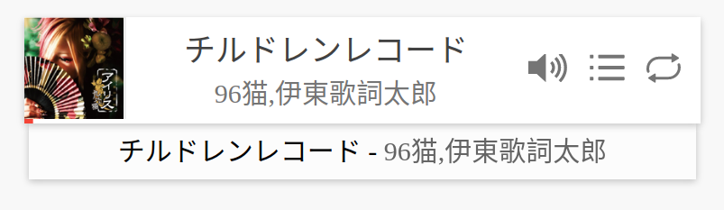

# cPlayer

[](https://www.npmjs.com/package/cplayer) [](https://github.com/MoePlayer/cPlayer) 



A beautiful and clean WEB Music Player by HTML5. [demo here](http://cplayer.js.org/).

# Feature

* 歌词显示
* 多歌曲播放列表
* 三种播放模式 单曲循环 列表循环 随机播放
* 专为触控优化的界面
* 模块化 定制性
* [Media Session 支持](https://developers.google.com/web/updates/2017/02/media-session)

# Quick Start

``` html
<div id="app"></div>
<!-- 加载 cplayer 脚本 -->
<script src=".../cplayer.js"></script>
<script>
  let player = new cplayer({
    element: document.getElementById('app'),
    playlist: [
      {
        src: '歌曲资源链接...',
        poster: '封面链接...',
        name: '歌曲名称...',
        artist: '歌手名称...',
        lyric: '歌词...',
        sublyric: '副歌词，一般为翻译...',
        album: '专辑，唱片...'
      },
      {
        ...
      },
      ......
    ]
  })
</script>
```

## webpack

```
npm install cplayer --save
```

```
import cplayer from 'cplayer';

new cplayer({
  ...
})
```

# 相关项目

[hexo-tag-cplayer](https://github.com/EYHN/hexo-tag-cplayer)

# Option

|OPTION|default content|description|
|:-----|:-------------:|:----------|
|element|`document.body`|注入播放器的目标元素。|
|playlist|`[]`|播放列表。|
|zoomOutKana|`false`|日语优化，缩小显示歌词中的假名。|
|playmode|`listloop`|默认播放模式。|
|volume|`1`|默认音量|
|point|`0`|开始播放的歌曲索引。|
|showPlaylist|`false`|显示播放列表，而不是当前歌曲信息。|
|autoplay|`false`|自动播放（移动端不可用）。|
|width|`''`|播放器宽度。|
|size|`12px`|播放器尺寸。|
|style|`''`|附加的css样式。|
|shadowDom|`'true'`|启用 [shadow DOM](https://developer.mozilla.org/zh-CN/docs/Web/Web_Components/Using_shadow_DOM)。|
|showPlaylistButton|`'true'`|显示播放列表按钮|
|dropDownMenuMode|`'bottom'`|菜单（播放列表和歌曲信息）的显示模式， ‘bottom’ 底部、 'top' 顶部、 'none' 不显示|

# Apis

- `cplayer.mode` 播放模式 目前支持3种播放模式。
  - `listloop` 列表循环
  - `singlecycle` 单曲循环
  - `listrandom` 列表随机播放
  ```
  cplayer.mode //获取当前播放模式

  cplayer.mode = 'listloop' //设置当前播放模式为列表循环
  ```
- `cplayer.volume` 音量 0.0 ~ 1.0。
- `cplayer.playlist` 只读 获取当前播放列表。
- `cplayer.nowplay` 只读 获取当前正在播放的歌曲。
- `cplayer.nowplaypoint` 只读 获取当前正在播放的歌曲在播放列表中的索引。
- `cplayer.played` 只读 是否正在播放。
- `cplayer.paused` 只读 是否已经暂停。
- `cplayer.toggleMode()` 切换播放模式 按 listloop > singlecycle > listrandom 的顺序
- `cplayer.setMode(playmode: string)` 设置播放模式与修改 `cplayer.mode` 等效。
- `cplayer.getMode()` 获取播放模式与获取 `cplayer.mode` 等效。
- `cplayer.play()` 开始播放
- `cplayer.pause()` 暂停播放
- `cplayer.to(id: number)` 跳转到指定曲目 id:歌曲的索引
- `cplayer.next()` 下一首
- `cplayer.prev()` 上一首
- `cplayer.togglePlayState()` 切换播放状态，暂停 > 播放，播放 > 暂停。
- `cplayer.add(item: IAudioItem)` 添加歌曲。
- `cplayer.remove(item: IAudioItem)` 删除歌曲。
- `cplayer.setVolume()` 设置音量与修改 `cplayer.volume` 等效。
- `cplayer.destroy()` 销毁播放器。
- `cplayer.view.getRootElement()` 获取 `<c-player />` 元素。
- `cplayer.view.showInfo()` 关闭播放列表，显示当前歌曲信息。
- `cplayer.view.showPlaylist()` 显示播放列表。
- `cplayer.view.toggleDropDownMenu()` 切换播放列表，关闭 > 打开，打开 > 关闭。

### Event

- `started`: 每首歌开始时触发，此时已经开始播放。
- `ended`: 歌曲播放到末尾时触发
- `play`: 开始播放时触发
- `pause`: 暂停播放时触发

> `play 事件` 和 `pause 事件` 必定交替触发。
> 需要注意的是上一首歌结束自动切换到下一首时不会触发 `play 事件`, 但会触发 `started 事件` 和 `openaudio 事件`。

- `playmodechange`: `play 事件` 和 `pause 事件` 的结合体
- `openaudio`: 打开音频时触发，但此时还不一定有音频数据。
- `volumechange`: 音量被改变时触发
- `timeupdate`: 更新播放时间

## 常见问题

<details><summary>如何播放网易云上的音乐？</summary><br>


### 在 `cplayer.js` 之后执行以下脚本

``` javascript
cplayer.prototype.add163 = function add163(id) {
  if (!id) throw new Error("Unable Property.");
  return fetch("https://music.huaji8.top/?id=" + id).then(function(res){return res.json()}).then(function(data){
    let obj = {
      name: data.info.songs[0].name,
      artist: data.info.songs[0].ar.map(function(ar){ return ar.name }).join(','),
      poster: data.pic.url,
      lyric: data.lyric.lyric,
      sublyric: data.lyric.tlyric,
      src: data.url.url,
      album: data.info.songs[0].al.name
    }
    this.add(obj);
    return obj;
  }.bind(this))
}
```

### 使用:

``` javascript
player.add163(12345678) //加入网易云id为 12345678 的歌曲
```

</details>


<details><summary>我只需要一个封装好的 audio api，不想要 UI ？</summary><br>

`dist` 文件夹中有 `cplayer-noview.js` 是去 UI 版的 cplayer。

</details>